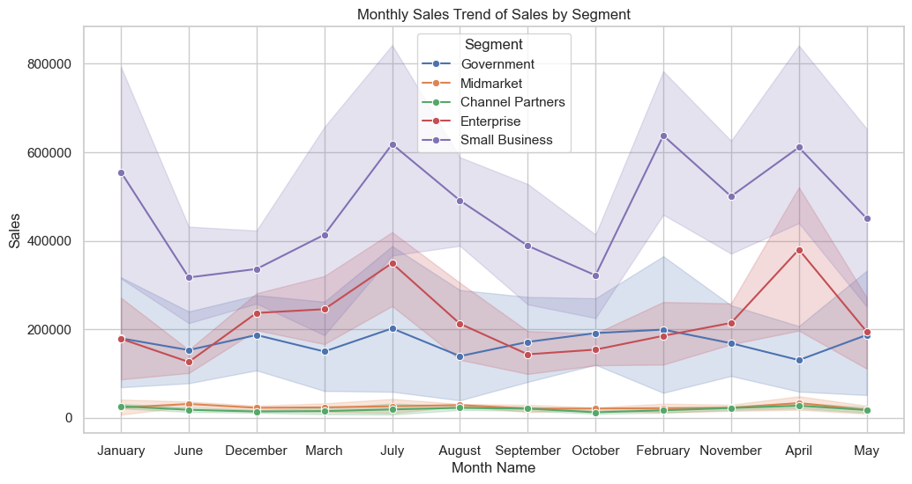
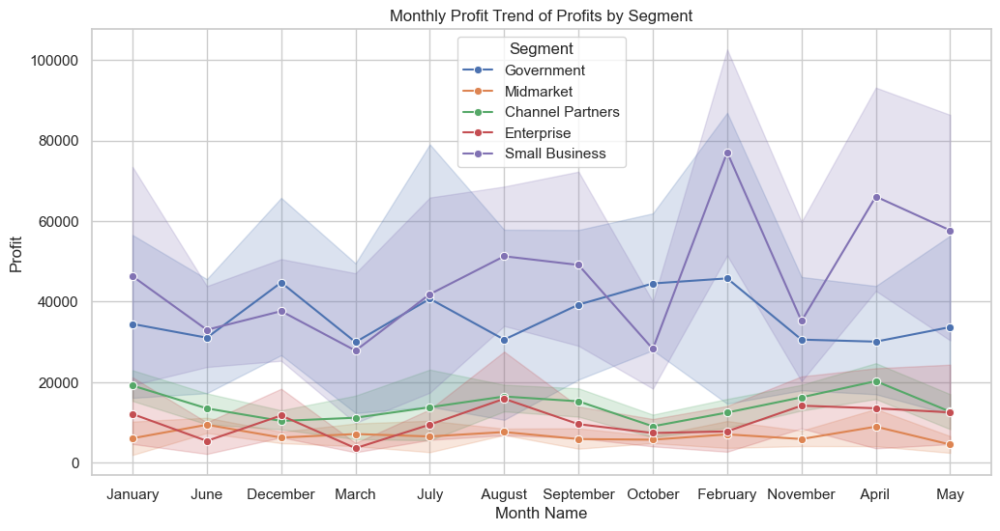
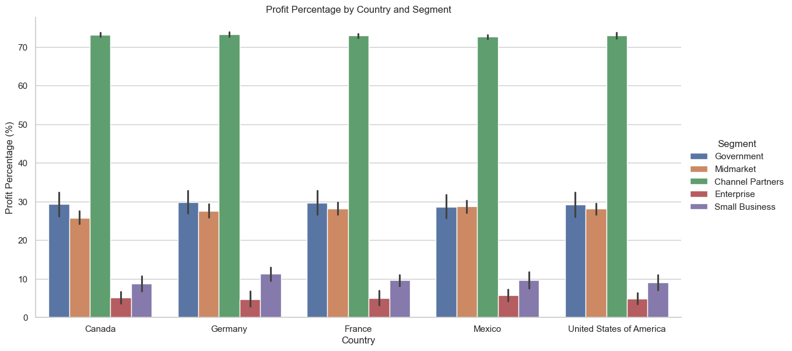
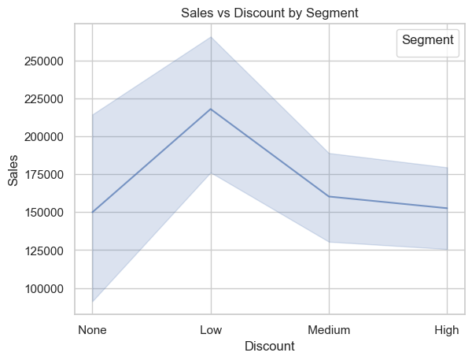
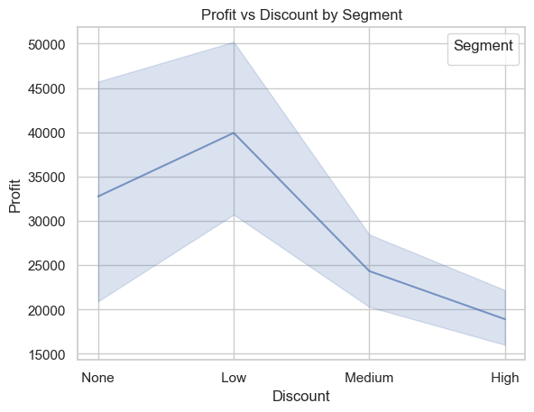
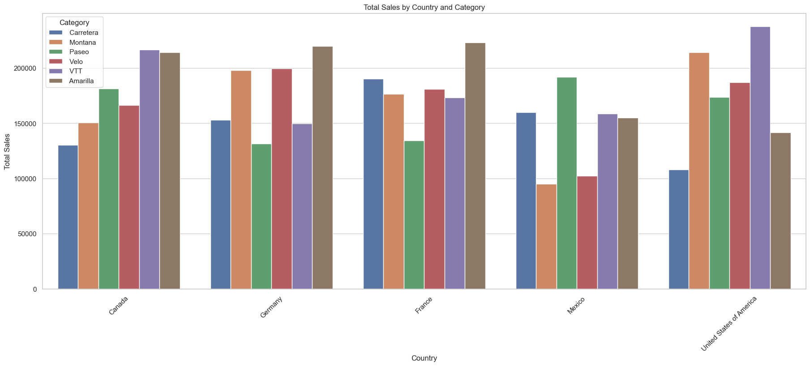
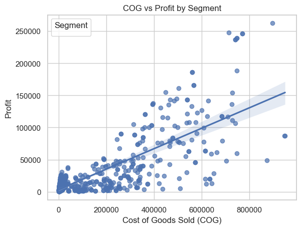

## 📊 Business Performance Analysis

### 📌 Overview
This project provides a comprehensive analysis of business performance through various key metrics, including **sales**, **profit**, **discounts**, and **customer segments**. By visualizing these metrics, we aim to identify trends, pinpoint areas of strength and weakness, and offer strategic insights for growth.

***

### 📂 Dataset
The analysis is based on a dataset containing sales and profit information, categorized by:
- **Segment**: Government, Midmarket, Channel Partners, Enterprise, and Small Business.
- **Geography**: Canada, Germany, France, Mexico, and the United States of America.
- **Category**: Carretera, Montana, Paseo, Velo, VTT, and Amarilla.
- **Time**: Monthly trends over a period of time.
- **Other Metrics**: Cost of Goods Sold (COG), Sales, Profit, and Discount levels.

***

### 📊 Visualizations & Insights

| Monthly Sales Trend by Segment | Monthly Profit Trend by Segment |
| :---: | :---: |
|  |  |
| The **Small Business** segment consistently generates the highest monthly sales, with significant peaks in January, July, and February. | Similar to sales, the **Small Business** segment leads in monthly profits, peaking above $80,000 in July and February. |

| Profit Percentage by Country and Segment | Sales vs. Discount by Segment |
| :---: | :---: |
|  |  |
| **Channel Partners** have the highest profit percentage across all countries. The **Government** and **Small Business** segments also show strong profitability. | Sales peak at **Low** discount levels and decrease as discounts become higher, suggesting that a low discount is most effective. |

| Profit vs. Discount by Segment | COG vs. Profit by Segment |
| :---: | :---: |
|  |  |
| Like sales, profit is highest with a **Low** discount. As the discount level increases, profit decreases significantly. | There is a strong **positive correlation** between Cost of Goods Sold (COG) and profit, indicating that higher-cost sales generally yield higher profits. |

| COG vs Profit (Detailed View) |
| :---: |
|  |
| There is a strong positive linear relationship between Cost of Goods Sold (COG) and profit. Higher-cost products generally yield higher profits. |

###

# Final Insights

- **COG vs Profit by Segment**  
  There is a strong positive linear relationship between Cost of Goods Sold (COG) and profit. Higher-cost products generally yield higher profits.

- **Total Sales by Country and Category**  
  The United States leads in overall sales, with Amarilla and VTT as the top-selling categories. Germany and France follow, while Canada and Mexico have lower sales volumes.

- **Monthly Sales Trend of Sales by Segment**  
  The Small Business segment dominates sales, consistently outperforming other segments. Sales peak in January, February, and July, surpassing $600,000 during these months.

- **Monthly Profit Trend of Profits by Segment**  
  Profit trends mirror sales, with Small Business generating the highest profits, peaking above $80,000 in February and July, confirming its key role in company profitability.

- **Profit Percentage by Country and Segment**  
  The Channel Partners segment achieves the highest profit percentage across all countries, showing superior efficiency in converting revenue into profit compared to other segments like Government and Small Business.

- **Sales vs Discount by Segment**  
  Sales are highest when discounts are low. Increasing discounts to medium or high levels causes significant sales declines, indicating low-level discounts are most effective for sales volume.

- **Profit vs Discount by Segment**  
  Profits peak at low discount levels and drop sharply as discounts increase to medium and high. High discounts negatively impact overall profitability.

## 📜 Author  
👨‍💻 *Sahil Chakraborty*
